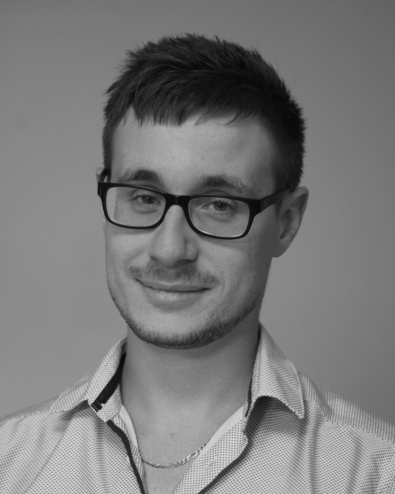

# Prénom Nom
*Développeur Logiciel Embarqué*

<!-- Colonne gauche -->

{:style="border-radius:50%;width:120px;"}

## Contact
📧 email@example.com  
📱 +33 6 12 34 56 78  
🌐 [github.com/username](https://github.com/username)  
🔗 [linkedin.com/in/username](https://linkedin.com/in/username)  

## Compétences
- C, C++, Python  
- FreeRTOS, STM32, NXP  
- Git, Docker, CMake  
- UART, SPI, I2C, CAN  

## Langues
- Français (natif)  
- Anglais (courant)  
- Allemand (notions)  

## Intérêts
- Robotique  
- IoT  
- Drone FPV  

<!-- Colonne droite -->

## Expérience professionnelle

**Société X** – *Ingénieur Logiciel Embarqué* (2021–présent)  
- Développement firmware sur STM32 (C, FreeRTOS)  
- Mise en place CI/CD (GitLab CI)  
- Optimisation mémoire et performance  

**Entreprise Y** – *Stage de fin d’études* (2020)  
- Développement driver CAN (NXP, C)  
- Validation avec oscilloscope et analyseur logique  

---

## Formation
🎓 Diplôme d’ingénieur en systèmes embarqués – École Z (2015–2020)  

---

## Projets personnels
- Développement d’un OS minimaliste pour ARM Cortex-M  
- Conception d’un drone FPV contrôlé via télécommande custom  
- Contribution à une librairie RTOS open-source sur GitHub  

